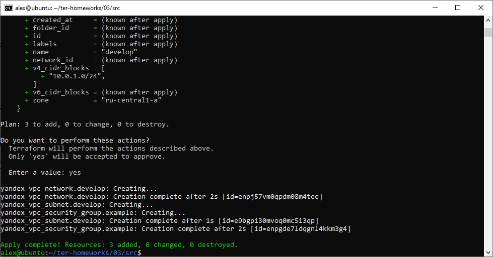
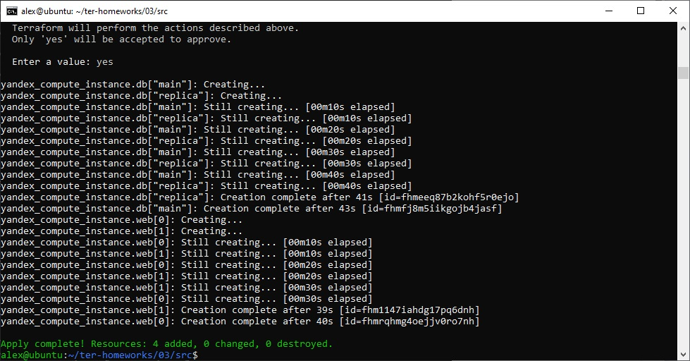
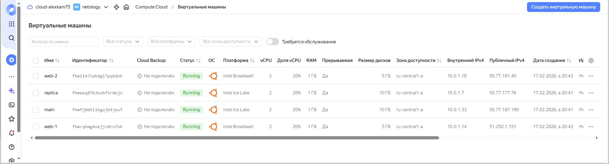
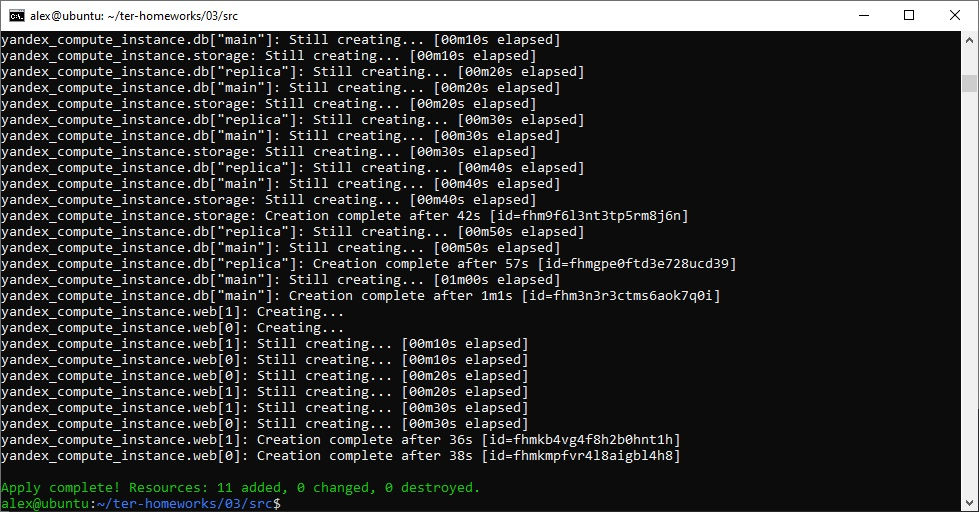
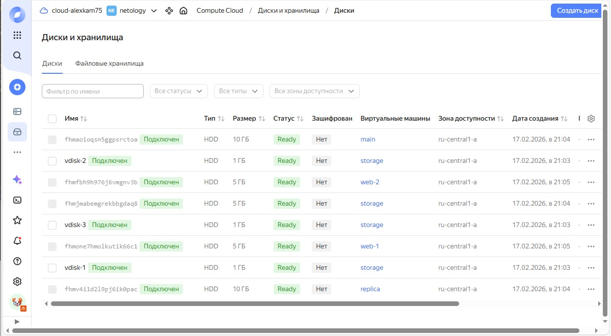
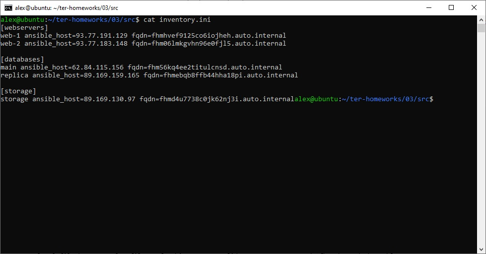
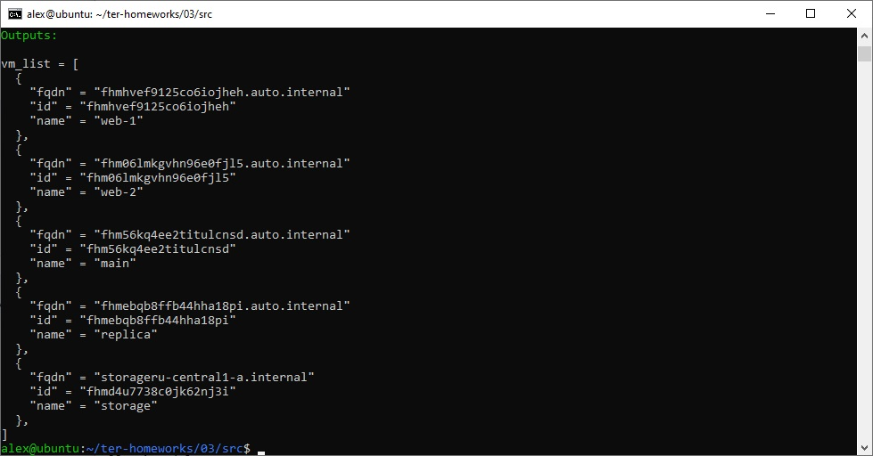

# Домашнее задание к занятию «Управляющие конструкции в коде Terraform»
## Задание 1
1. Изучите проект.
2. Инициализируйте проект, выполните код.



Приложите скриншот входящих правил «Группы безопасности» в ЛК Yandex Cloud .


## Задание 2
1. Создайте файл count-vm.tf. Опишите в нём создание двух одинаковых ВМ web-1 и web-2 (не web-0 и web-1) с минимальными параметрами, используя мета-аргумент count loop. Назначьте ВМ созданную в первом задании группу безопасности.(как это сделать узнайте в документации провайдера yandex/compute_instance )
### count-vm.tf
```
resource "yandex_compute_instance" "web" {
  count = 2

  name        = "web-${count.index + 1}" 
  platform_id = "standard-v1"
  zone        = var.default_zone

  resources {
    cores  = 2
    memory = 1
    core_fraction = 20
  }

  boot_disk {
    initialize_params {
      image_id = data.yandex_compute_image.os_image.id
    }
  }
  
  scheduling_policy {
    preemptible = true  # Использую preemptible
  }

  network_interface {
    subnet_id          = yandex_vpc_subnet.develop.id
    nat                = true
    security_group_ids = [yandex_vpc_security_group.example.id]
  }
  
  depends_on = [yandex_compute_instance.db] 
  
  metadata = local.full_metadata
}
```
2. Создайте файл for_each-vm.tf. Опишите в нём создание двух ВМ для баз данных с именами "main" и "replica" разных по cpu/ram/disk_volume , используя мета-аргумент for_each loop. Используйте для обеих ВМ одну общую переменную типа:
```
variable "each_vm" {
  type = list(object({  vm_name=string, cpu=number, ram=number, disk_volume=number }))
}
```
### for_each-vm.tf
```
resource "yandex_compute_instance" "db" {
  for_each = { for idx, vm in var.each_vm : vm.vm_name => vm }

  name        = each.value.vm_name
  platform_id = each.value.platform_id
  zone        = var.default_zone

  resources {
    cores         = each.value.cpu
    memory        = each.value.ram
    core_fraction = each.value.core_fraction
  }

  boot_disk {
    initialize_params {
      image_id = data.yandex_compute_image.os_image.id
      size     = each.value.disk_volume
      type     = each.value.disk_type
    }
  }

  network_interface {
    subnet_id          = yandex_vpc_subnet.develop.id
    nat                = each.value.nat
    security_group_ids = [yandex_vpc_security_group.example.id]
  }

  scheduling_policy {
    preemptible = each.value.preemptible
  }

  metadata = local.full_metadata
}
```
При желании внесите в переменную все возможные параметры. 4. ВМ из пункта 2.1 должны создаваться после создания ВМ из пункта 2.2. 5. Используйте функцию file в local-переменной для считывания ключа ~/.ssh/id_rsa.pub и его последующего использования в блоке metadata, взятому из ДЗ 2. 6. Инициализируйте проект, выполните код.





## Задание 3
1. Создайте 3 одинаковых виртуальных диска размером 1 Гб с помощью ресурса yandex_compute_disk и мета-аргумента count в файле disk_vm.tf .
### disk-vm.tf
```
resource "yandex_compute_disk" "vdisk" {
  count = 3

  name     = "vdisk-${count.index + 1}" 
  size     = 1
  type     = "network-hdd"
  zone     = var.default_zone
}

resource "yandex_compute_instance" "storage" {
  name        = "storage"
  platform_id = "standard-v1"
  zone        = var.default_zone

  resources {
    cores  = 2
    memory = 1
    core_fraction = 20
  }

  boot_disk {
    initialize_params {
      image_id = data.yandex_compute_image.os_image.id
    }
  }

  scheduling_policy {
    preemptible = true
  }

  network_interface {
    subnet_id          = yandex_vpc_subnet.develop.id
    nat                = true
    security_group_ids = [yandex_vpc_security_group.example.id]
  }

  dynamic "secondary_disk" {
    for_each = yandex_compute_disk.vdisk

    content {
      disk_id = secondary_disk.value.id
    }
  }

  metadata = local.full_metadata
}
```
2. Создайте в том же файле одиночную(использовать count или for_each запрещено из-за задания №4) ВМ c именем "storage" . Используйте блок dynamic secondary_disk{..} и мета-аргумент for_each для подключения созданных вами дополнительных дисков.





## Задание 4
1. В файле ansible.tf создайте inventory-файл для ansible. Используйте функцию tepmplatefile и файл-шаблон для создания ansible inventory-файла из лекции. Готовый код возьмите из демонстрации к лекции demonstration2. Передайте в него в качестве переменных группы виртуальных машин из задания 2.1, 2.2 и 3.2, т. е. 5 ВМ.
### ansible.tf
```
resource "local_file" "ansible_inventory" {
  content = templatefile("${path.module}/inventory.tftpl",

  {
    webservers = yandex_compute_instance.web
    databases  = values(yandex_compute_instance.db)
    storage    = [yandex_compute_instance.storage]
  })

  filename = "${path.module}/inventory.ini"
}
```
2. Инвентарь должен содержать 3 группы и быть динамическим, т. е. обработать как группу из 2-х ВМ, так и 999 ВМ.
### inventory.tftpl
```
[webservers]
%{~ for i in webservers }
${i.name} ansible_host=${i.network_interface[0].nat_ip_address} fqdn=${i.fqdn}
%{~ endfor }

[databases]
%{~ for i in databases }
${i.name} ansible_host=${i.network_interface[0].nat_ip_address} fqdn=${i.fqdn}
%{~ endfor }

[storage]
%{~ for i in storage }
${i.name} ansible_host=${i.network_interface[0].nat_ip_address} fqdn=${i.fqdn}
%{~ endfor }
```
3. Добавьте в инвентарь переменную fqdn.
```
[webservers]
web-1 ansible_host=<внешний ip-адрес> fqdn=<полное доменное имя виртуальной машины>
web-2 ansible_host=<внешний ip-адрес> fqdn=<полное доменное имя виртуальной машины>

[databases]
main ansible_host=<внешний ip-адрес> fqdn=<полное доменное имя виртуальной машины>
replica ansible_host<внешний ip-адрес> fqdn=<полное доменное имя виртуальной машины>

[storage]
storage ansible_host=<внешний ip-адрес> fqdn=<полное доменное имя виртуальной машины>
```
Пример fqdn: web1.ru-central1.internal(в случае указания переменной hostname(не путать с переменной name)); fhm8k1oojmm5lie8i22a.auto.internal(в случае отсутвия перменной hostname - автоматическая генерация имени, зона изменяется на auto). нужную вам переменную найдите в документации провайдера или terraform console. 4. Выполните код. Приложите скриншот получившегося файла.



## Задание 5*
1. Напишите output, который отобразит ВМ из ваших ресурсов count и for_each в виде списка словарей :
### output.tf
```
output "vm_list" {
  description = "VM List Name, id, fqdn"
  value = flatten([
    [
      for i in yandex_compute_instance.web : {
        name = i.name
        id   = i.id
        fqdn = i.fqdn
      }
    ],
    [
      for i in values(yandex_compute_instance.db) : {
        name = i.name
        id   = i.id
        fqdn = i.fqdn
      }
    ],
    [
      {
        name = yandex_compute_instance.storage.name
        id   = yandex_compute_instance.storage.id
        fqdn = "${yandex_compute_instance.storage.name}${var.default_zone}.internal"
      }
    ]
  ])
}
```
```
[
 {
  "name" = 'имя ВМ1'
  "id"   = 'идентификатор ВМ1'
  "fqdn" = 'Внутренний FQDN ВМ1'
 },
 {
  "name" = 'имя ВМ2'
  "id"   = 'идентификатор ВМ2'
  "fqdn" = 'Внутренний FQDN ВМ2'
 },
 ....
...итд любое количество ВМ в ресурсе(те требуется итерация по ресурсам, а не хардкод) !!!!!!!!!!!!!!!!!!!!!
]
```
Приложите скриншот вывода команды terrafrom output.


